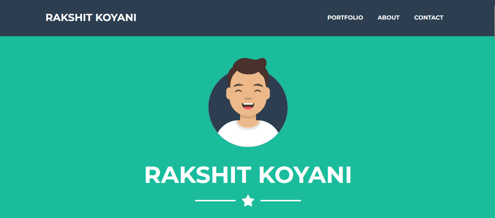
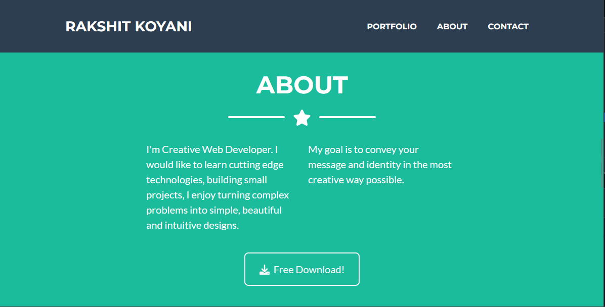

<!-- Social Links -->

[![LinkedIn][linkedin-shield]][linkedin-url]
[![Instagram][instagram-shield]][instagram-url]
[![Hashnode][hashnode-shield]][hashnode-url]

> 

> 
>
> - `React JS🤓 is today's most popular JavaScript Library for building User Interfaces, which has created by Facebook.`
> - ` It is an efficient, flexible, and open-source JavaScript library, that was developed and is maintained by Facebook.🤠 It is capable of rendering front-ends of web apps that are simple, speedy, and scalable.`

> # All About `Basic React Template Project` 😎

# **Gained expertise through this project :**

- Learnt indepth of `REACTJS`

- Learned the importance of React Virtual DOM.

- Learned about JSX [JSX (JavaScript XML) is a syntax extension to JavaScript used by React. JSX is basically used to write HTML tags inside JavaScript. Later, the JSX code will be translated into normal JavaScript.]

- Understand how to make components[Its applications work only after using the components. And each component has its own features.]

- Also it is one way data binding [This feature helps more in controlling the app as it uses a unidirectional data flow or one-day data binding.]

- Learned about Functional Components

- `Reminder` : This is a Bootstrap Template just to understand components i have used this template.And this is a Responsive design.

> # Designed With 😇
>
> ## TECHNOLOGIES USED
>
>  >  >  > 
>
> ## Making Use of Tools
>
>  > > > >

# HERE IS THE PREVIEW HOW THIS PROJECT LOOKS😍

> # [LIVE [HOSTED] PROJECT LINK](https://basic-react-template-portfolio.vercel.app/) "Basic React Template Project")

>  > >

# HAPPY LEARNING 🤩

<!-- Linkedin -->

[linkedin-shield]: https://img.shields.io/badge/-LinkedIn-black.svg?style=for-the-badge&logo=linkedin&colorB=0B5FBB
[linkedin-url]: https://www.linkedin.com/in/rakshit-koyani-507040132/

<!-- Instagram -->

[instagram-shield]: https://img.shields.io/badge/Instagram-%23E4405F.svg?style=for-the-badge&logo=Instagram&logoColor=white
[instagram-url]: https://www.instagram.com/rakshitkoyaniofficial/

<!-- Hashnode -->

[hashnode-shield]: https://img.shields.io/badge/Hashnode-2962FF?style=for-the-badge&logo=hashnode&logoColor=white
[hashnode-url]: https://rakshitkoyani.hashnode.dev/
